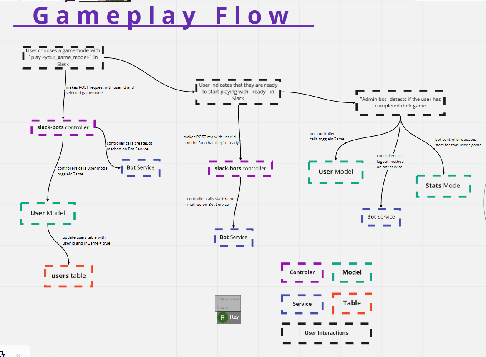
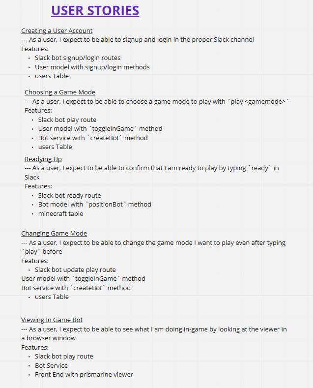
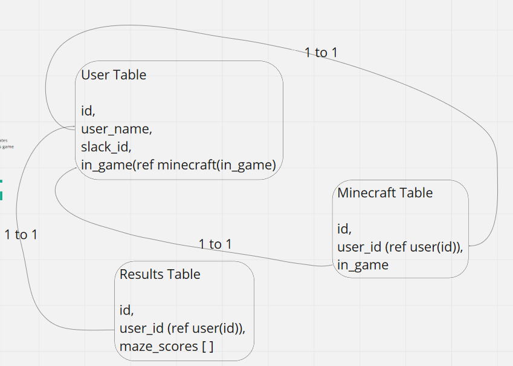

# mind-crafting

By Donny Vu, Ryan Carreras, Ray Sakultarawattn, and Sam Formichella

Play minigames in Minecraft with a text-based environment in Slack!

Wireframe: 

User stories: 

SQL Relationships: 

Software Requirements: https://github.com/Mind-Crafting/mind-crafting/blob/dev/requirements.md
